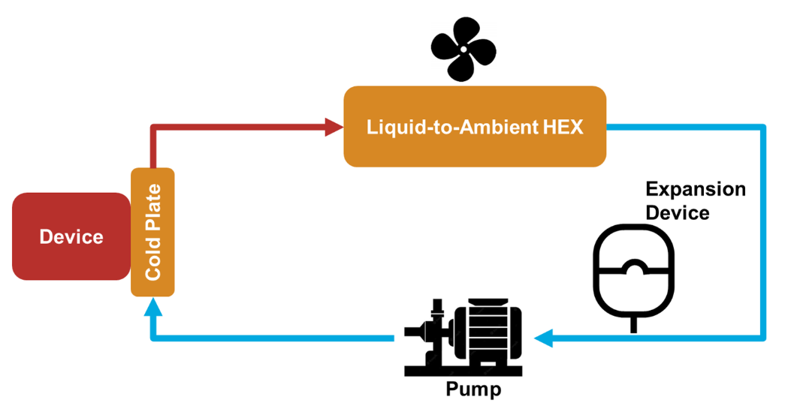
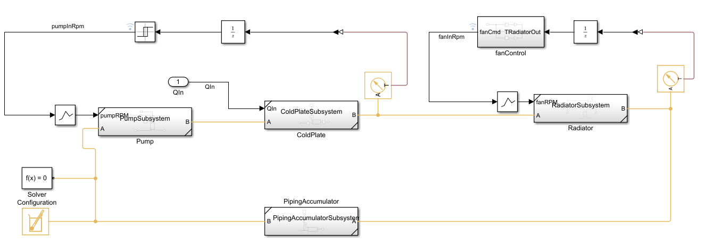

# Liquid Cooling System Design with Simscape Fluids™

In this tutorial, we introduce how to build and parameterize a Simscape 
Fluids&trade; model for a liquid cooling system based on a small set of
requirements. We show the recommended procedures for building test 
harnesses for and sizing components, parameterizing the various elements 
from known data, e.g., dimensions, data sheets, etc., and implementing 
rudimetary controls for the system. It is intended as a reference for 
learning Simscape Fluids and understanding how to approach system-level 
thermal design. 

## Getting started

Open the thermal_management_tutorial.prj file. It will direct you to the main
tutorial live script. You can navigate the steps from there.

## MathWorks Products 

* [MATLAB&reg;](https://www.mathworks.com/help/matlab/index.html)
* [Simulink&reg;](https://www.mathworks.com/help/simulink/index.html)
* [Simscape&trade;](https://www.mathworks.com/help/overview/physical-modeling.html)
* [Simscape Fluids&trade;](https://www.mathworks.com/help/hydro/index.html)

## License

See the licence.txt file in the top directory.

## Community Support

[MATLAB Central](https://www.mathworks.com/matlabcentral/)

&copy; 2025 The MathWorks, Inc.